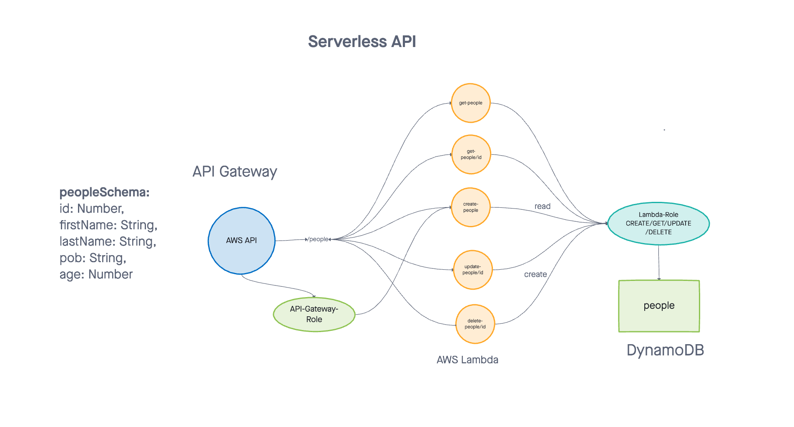
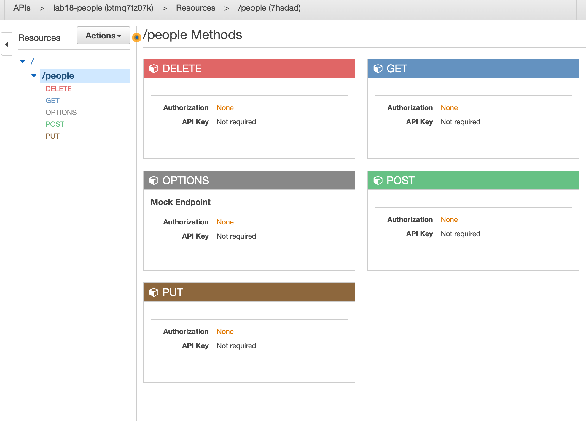

# serverless-api

Created by Harvey Lucas and Roop Hayer

## API Root URL

https://btmq7tz07k.execute-api.us-west-2.amazonaws.com/beta/people

## Summary of Problem Domain

### Lab: Class 18

AWS: API, Dynamo and Lambda

Create a single resource REST API using a domain model of your choosing, constructed using AWS Cloud Services

- Database: DynamoDB
- Routing: API Gateway
- CRUD Operation Handlers: Lambda Functions

https://btmq7tz07k.execute-api.us-west-2.amazonaws.com/beta/people?id=1

## Schema

```javascript
{
    id: Number,
    firstName: String,
    lastName: String,
    pob: String,
    age: Number
}
```

## Routes

POST
Path: /people?id=#

- Given a JSON body, inserts a record into the database
- Returns an object representing one record, by its id (#)

GET (All)

- Path: /people
- Returns: an array of objects representing the records in the database

GET (One)

- Path: /people?id=#
- Given an ID (#), retrieves that recorde from the database
- Returns: returns an object representing one record, by its id (#)

PUT

- Path: /people?id=#
- Given a JSON body and an ID (#), updates a record in the database
- Returns:

```plaintext
On success: String - "Item updates successfully"
On error: String - "Enter valid id to update"
```

DELETE

- Path: /people?id=#
- Given an ID (#), deletes that recorde from the database
- Returns: String "Successfully deleted an item!"

## Visuals




